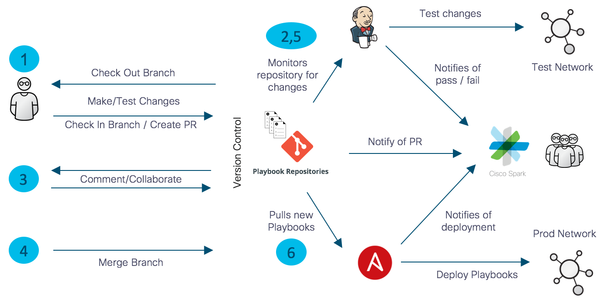
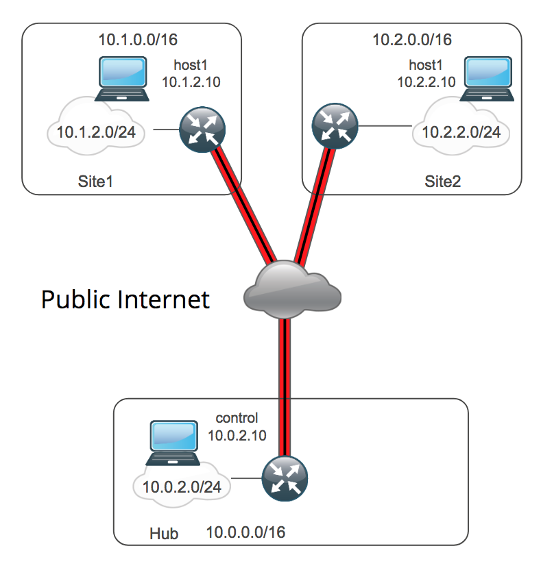

# DEVNET-2076: Cisco Live US 2018

This repo contains the material used in the DEVNET-2076 session at Cisco Live US 2018.  It is a scaled down version of what might be used in a real environment that illustrates one possible DevOps pipeline for networks with Ansible.  

## Background

### What is Infrastructure as Code?

Infrastructure as Code IaC can be summarized as defining your infrastructure as code, then maintaining the lifecycle of that code (and your infrastructure as a result) through a application development-like process.  This code is generally a task-by-task translation of the Method of Procedure (MOP) for a particular complex operation (e.g. Add provision a new remote site, add a tenant network, etc).  More to the point, it is generally the culmination of the human experience of the Subject Matter Experts within the group that created the MOP.  Having these procedure and SME experience in code has the benefits of:

* **Configuration Management**: Ensure the correctness and consistency of the code that defines the network
* **Revision Control**: Manage and assign version to the changes to the code
* **Drift Detection**: Detect configuration drift in the infrastructure by comparing it against the code the describes that infrastructure.
* **Communication**: Instead of the architecture and the experience to run it being locked in the head of a few, it is accessible by all.  Furthermore, it allows different SMEs to leveraged other SME's area of expertise.

Another aspect of IaC is the ability to actually run the MOP after it is translated into code.  This gives someone the ability to undertake these operations in a rapid, repeatable way that reduces the number of variations in the configuration of a network.

## NetDevOps

### What is NetDevOps?

From Wikipedia:
> DevOps is a software engineering culture and practice that aims at unifying software
> development (Dev) and software operation (Ops). The main characteristic of the DevOps
> movement is to strongly advocate automation and monitoring at all steps of software
> construction, from integration, testing, releasing to deployment and infrastructure
> management.

That is, DevOps adds the process (e.g. collaboration, testing, deployment) that is needed to properly undertake automating with IaC.

## Why NetDevOps?

The ability to undertake operation fast with automation is enticing, but it must be done with caution and with focus on a particular outcome.  Automation tools such as Ansible are simply a mechanism to automate the individual tasks that are normally manually performed by a network operations teams.  Ansible has no innate intelligence for determining a good task from a bad task, so it will happily and efficiently create or destroy depending on the inventory and playbooks fed to it.  Also, Infrastructure as Code (IaC) network automation systems are generally made up of components from several different sources.  Each of these sources are separately developed and versions.  A change in one of these components can perturb the entire system.  For these reasons, successful network-automation at scale should be integrated into any NetDevOps deployments.  

What does that look like?



1. Checkout the branch (either personal or shared dev branch).  Make the code change to that branch and test the change in local sandbox.  Once the engineer is satisfied with the change and has properly tested it, they create a Pull Request (PR) to start tell everyone that they are ready to submit the change.  This is where others in the group get to see and comment on the change _before_ it is merged.  This is also were validation tests can be run _before_ the change is merged.

2. Jenkins, or some other automated testing engine, would be used at this point to perform the validations tests.  These tests can be performed through Jenkins manually (either directly or something like a comment) or automatically for every PR.  In either case, Jenkins reports back with the results of the tests.

3. At this point, the group collaborates on the change to make sure that it is understood, that it aligns with organizational best practices, and that it is properly tested with standardized validation tests.

4. Once the change is agreed upon and properly tested, it is merged into the production branch.  

5. Jenkins can either test the production branch one the change is merged, at regular intervals, or both.

6. The change now lives in the production "Golden" artifact repository.  From here, an orchestrion tool such as Ansible Tower can pick up that artifact and push it out as part of an operator-initiated request, a timed running to validate align the configuration of the infrastructure with the IaC that defines it, or an API call from another application.

**In a strict IaC paradign, _EVERY_ change goes through this process.**

## Outcomes: Automated Humans vs. Automated Business

### Automating Humans

Let us pause for a moment to ponder what we are trying to achieve.  If we _just_ want a human to be able to perform an operation faster by automating all tasks with IaC within a NetDevOps workflow, then we might not _actually_ achieve that.  Why is this?  Automation is geared at deploying single or multiple changes across a large number of devices.  

### Engineering vs. CRUD

There are basically two types of changes that are made to a network in stead state operations:

* Architectural/Engineering: These are changes to the architecture of the network (e.g. Routing, QoS, Multicast) that generally affect the entire network.  It is also the architecture for how new services are deployed (e.g. tenants, remote sites, etc.)
* Create, Read, Update, Delete (CRUD): These are changes that deal with delivering of network services to a particular customer or application (e.d. Putting a port in a VLAN, adding an ACE to an ACL, or adding a load balancing rule).

The rigor of IaC is absolutely the way to make major architectural changes to a network because of the network-wide effect that these changes have and the relatively small number of changes that occur.   

CRUD is often different, however.  Making a single change (e.g. SNMP Community Strings) on thousands of devices is an operation for which the overhead of NetDevOps is justified.  However, if a single change is needed on a single device (e.g. Change a interface's access VLAN), the NetDevOps overhead slows that task down significantly.

This overhead is not necessarily a bad thing, even for small changes.  There are significant advantages in enforcing configuration management, revision control, code review, and testing on _every_ change.  It does not, however, always make network operations faster or easier.  This increased friction can make it unpalatable to many network teams and hinder adoption.

We should then focus more on automating business processes and less on _just_ automating humans.  

### Source of Truth (SoT)

One area in which Devops for application development differs from DevOps for network operation is the Source of Truth.  The Source of Truth of a network contains all of the values that make a network _that_ network.  In its simplest form, those values are things like hostname, NTP servers, users, AAA servers, etc.  These values are relatively few in number and are used across all of the devices.  The problem comes with values that define thing like interface configuration, ACLs, and load-balancing rules.  Even for a mid-size network, the number of values that define the configuration of that network could be over 100,000s.  Keeping 100,000+ values in flat files in a code repository can be at best painful and at worst untenable.

Another use case in which the separation of the SoT from the Code is critical is Cloud and other virtualized platforms.  On these virtualized platforms, virtual routers, firewalls, load-balancers, etc. are being dynamically created and destroyed to accomodate customer requests and/or user workloads.  To manually copy this inventory data from their native platforms (e.g. AWS) would fight against the agile posture that we are trying to achieve with automation.  This can better be accommodated by pulling the SoT dynamically from those platforms.

This is why, for any meaningful deployments, the SoT is kept and managed separately from the code that references it.  This bifurcation helps address both the overhead problem and, as we'll see later, testing.

### Implementation (SoT) + Definition (Code) = Deployment

When we decouple the SoT from the code, it is the code that is strictly managed through the full NetDevOps workflow since changes to it affect the architecture and policy of the entire network which justifies the associated rigor and overhead.

The SoT is then managed separately.  This is not to say that non of the SoT is in code/file form.  Much of the common values that define constants across the network and have a large collateral affect (e.g. NTP servers, AAA servers, SNMP Community Strings) can still be managed with code.  But the values associated with the day-to-day CRUD generally live in an external database or CMDB.

### Automating Business Processes: API-Driven Automation

This SoT/Code bifurcation also enables the automation of the business processes that were likely the original goal of automation in the first place.  When the SoT is external to the automation infrastructure, those values that comprise it can be changed externally, then feed into the process.  For example, a user that wants to add an exception for a server can go to a self service portal to request that exception.  That request can then go through the review process to make sure that it is align with business policies and appropriately approved.  The SoT can be updated with this exception and the portal can call an API to tell the automation infrastructure to push out that change.  This accomplishes two equally important objectives:

1. To take the network team out of the CRUD
2. To allow the network team to define and put checks around how changes to the network are performed

## DevOps Infrastructure

For this session, we present an infrastructure to implement a full NetDevOps workflow in a way that is representative to what many organizations deploy.  It is, in fact, a real-world deployment in that it is the "Dev" part of a set of companion sessions that we are delivering at CLUS 2018.  The other Session, BRK-2023: Building Hybrid Clouds in Amazon Web Services with the CSR 1000v, includes a demo for deploying CSR-based cloud nodes in public clouds and connecting them with a DMPVN overlay.  That demo uses the production artifacts created in this session.

Our NetDevOps workflow is facilitated by the following infrastructure:

* Source Code Management: GitHib
* Test Automation: Jenkins
* Production Deployment: Ansible Tower
* Collaboration Platform: Cisco WebEx Teams

### Source Code Management: GitHub

We use GitHub for our source code management because of its ubiquitous nature and easy access.  Many organizations leverage GitHub Enterprise or some other internally install git system like GitLab or BitBucket.  Most SCMs have similar mechanisms to what is laid out in this description.

#### Repository Layout

The layout of the repo is pretty standard for Ansible.  The main point is in how the layout is used.  For example, Ansible allows one to specify the inventory to be used.  In this repo, we have two different inventories: test and prod. A couple of key points to remember about Ansible is that an `inventory` contains both the list of devices to automate and the key/value pairs (a.k.a Source of Truth) that defines how those devices are configured.  

```
.
├── Jenkinsfile
├── LICENSE
├── README.md
├── build-testbed.yml
├── destroy-testbed.yml
├── inventory                   |
│   ├── prod                    |  Different inventories for test & prod
│   └── test                    |
├── network-checkpoint.retry
├── network-checkpoint.yml
├── network-dmvpn-check.yml
├── network-dmvpn.yml
├── network-system.yml
└── roles                       |
    ├── cloudbuilder            |  Roles linked in as submodules.  Unit testing
    ├── network-backup          |  is performed on each role.
    └── network-dmvpn           |
```

Playbooks should embody the intent, architecture, and policy of a particular network.  It should *not* contain references to specific nodes nor the specific values that are used to configure these nodes.  That brings us back to:

#### Implementation (SoT) + Definition (Playbooks) = Deployment

This is the key capability that we need to test playbooks.  We architect the playbook to meet the needs of our production network (i.e. architecture and policy).  We then create a testbed that mimics the key aspects of the production network, but at a smaller scale.  When the inventory/SoT for the test network is fed into the playbooks, it yields the test network.  This obviously gives us the ability to catch simple syntactical errors, but it also give the ability to test the architecture defined in the playbooks on something other than the production network.

#### Repository Modularity

To provide modularity, we have one main repository that represents a project, then several repositories linked in as submodules to provide the Roles.  Using submodules allows for keeping the roles in their own repositories to facilitate unite testing and the linking to a specific version of a Role.  Linking to a specific version of a Role that is known to work with a project allows for the choice of when to use a newer version.  This would generally be done as part of the integration testing done at the project repository level.

#### Repositories

In this example, we are using 3 different types of repositories:

* **Role Repositories**: These repositories are linked in as submodules and contain all of the playbooks, modules, vars, etc. that comprise a the individual Ansible Roles:
  * [network-dmvpn](https://github.com/ismc/ansible-network-dmvpn.git):  An Ansible Roles that deployes a DMVPN overlay over a hub and spoke network.
  * [network-backup](https://github.com/ismc/ansible-network-backup.git): An Ansible Role that provides backup, checkpoint, and rollback for network devices.
  * [cloudbuilder](https://github.com/ismc/ansible-cloudbuilder.git): An Ansible Role to build a cloud-agnostic model in a Public Cloud.
* **Inventory Repositories**: These repositories contain the inventories that will be used by a particular project.
* **Project Repository**:  This is the top level repository that contains all of the Ansible Playbooks, Roles, and Inventory that is needed by a particular project.  It is representative of the kind of structure you could use in a production environment.

### Branch protection

GitHub's [branch protection](https://help.github.com/articles/about-protected-branches/) ensures that collaborators on your repository cannot make irrevocable changes to branches. Enabling protected branches also allows you to enable other optional checks and requirements, like required status checks and required reviews.

For this demonstration, we protect the `master` branch and develop on the `devel` branch.  Code changes can be checked in directly to the `devel` branch.  The `devel` branch is tested ad-hoc and at regular intervals.  Changes are not allowed to be pushed directly into the `master` branch and must go through the full NetDevOps workflow by using a Pull Request (PR).  The `master` branch is also tested ad-hoc and on regular intervals.

### Test Automation: Jenkins

Jenkins is a self-contained, open source automation server which can be used to automate all sorts of tasks related to building, testing, and delivering
or deploying software.

#### What kind of changes can we test?

To use somewhat circular reasoning, we can test anything for which we can build a test.  Testing the syntactical correctness is easy.  We can simply run the playbooks against anything and they will either fail or not.  Better yet, we can use Ansible's built-in syntactical checker.  To test the functionality of the code, we perform a combination of Unit and Integration testing.

#### Testing Methodologies: Unit vs. Integration

#### Unit Testing

Unit testing in generally done in Ansible by testing roles.  An Ansible [Roles](http://docs.ansible.com/ansible/latest/user_guide/playbooks_reuse.html) is the main unit of code reuse and portability.  Roles are an aggregation of tasks, modules, vars, etc. that accomplish a complex operation.  The are written once, then leveraged multiple times across different playbooks.  Unit testing is done at the role level.  By testing the Role, we validate that it properly undertakes specific the task for which it was written.  For the purposes of this session, that Role is [network-dmvpn](https://github.com/ismc/ansible-network-dmvpn.git)

#### Integration Testing

Integration testing is done when we integrate the Roles (i.e. the units) into the playbooks that setup the overall system.  For example, for DMVPN to work, the interfaces need to be properly configured.  This is a simple example, but there are several different systems of the network device (e.g. AAA, port configuration, routing protocols, etc.) are configured by different playbooks and they could all be tested together whenever possible.

### Testing Infrastructure

Since it is desirable to avoid testing on a production network whenever possible, a testbed is needed.  Generally, there are 2 options available:

* Physical: A representative, but scaled down version of the production network.
* Virtual:  This can take the form of a proper emulator like [Cisco VIRL](http://virl.cisco.com/) or by using VNFs on a virtualized infrastructure (e.g. OpenStack, VMware) or public cloud (e.g. AWS, Azure, GCE).

For this session, we use the example of a hub/spoke network that uses DMVPN as an overlay because it is regular (i.e. easy to automate) and easy to simulate.  In this case, our physical/production network if comprised of Cisco ISRs running IOS-XE.  Since Cisco IOS-XE is available in the form of the Cisco Cloud Service Router VNFs, we can create an accurate testbed using a public cloud.

### Test network

Our DMVPN testbed consists of 3 sites, each a VPC in AWS.  Each site have a Cisco CSR as its site router with and inside and outside interface.  Each inside network has a single host for connectivity testing:



### Production Deployment: Ansible Tower

Ansible Tower as a means for pushing out production artifacts is important for 2 reasons:

* Controlled release of automation.  

### Collaboration Platform: Cisco WebEx Teams

ChatOps functions are achieved using WebEx Teams. The WebEx Teams app provides many integrations with various DevOps tools, including both GitHub and Jenkins. These can be enabled for an arbitrary space via the WebEx Teams App Hub.

#### WebEx Teams Jenkins integration


In order to enable the Jenkins integration, you need to do the following:

* Visit the WebEx Teams App Hub and enable the Jenkins integration for your space and copy the created webhook URL
* Install the Notification plugin on your Jenkins server
* Add an entry in your Jenkinsfile to call the WebEx Teams webhook you copied earlier for all notifications

The required entry in the Jenkinsfile can be found by using the "Pipeline Syntax" functionality in Jenkins. Go to the pipeline page in the Jenkins server and select Pipeline Syntax, then "properties" from the drop down list. In here you can insert the webhook URL and generate the needed script code for your Jenkinsfile.

The properties section should look something like:

```
properties([[$class: 'HudsonNotificationProperty', endpoints: [[buildNotes: '', urlInfo: [urlOrId: 'http://cisco-spark-integration-management-ext.cloudhub.io/api/hooks/8fde6043-69b6-11e8-bf37-0123456789ef', urlType: 'PUBLIC']]]]])
```

## Repository Usage

Since this is a complex system composes of several parts, all of those parts must be in place and configured to completely reproduce this work.  However, Since this repository used submodules, it has to be checked out recursivley:

```
https://github.com/ismc/devnet-2076_clus2018.git --recursive
```

To build the testbed:

```
ansible-playbook build-testbed.yml
```

To run the DMVPN Integration tests:

* Set the baseline system and interface configuration:

```
    ansible-playbook -i inventory/test network-system.yml
```

* (Optional) Checkpoint the routers after the initial configuration and before the DMVPN deployment.

```
    ansible-playbook -i inventory/test network-checkpoint.yml
```

* Deploy the DMVPN overlay:

```
    ansible-playbook -i inventory/test network-dmvpn.yml
```

* Check to make sure that DMVPN overlay as properly deployed

```
    ansible-playbook -i inventory/test network-dmvpn-check.yml
```

* (Optional) Rollback the router configuration to the state before the DMVPN overlay was deployed.

```
    ansible-playbook -i inventory/test network-rollback.yml
```

To destroy the testbed:

```
ansible-playbook desroy-testbed.yml
```
## WebEx Teams Integrations

ChatOps functions are achieved using WebEx Teams.  The WebEx Teams app provides many integrations with various DevOps tools, including both GitHub and Jenkins.  These can be enabled for an arbitrary space via the WebEx Teams App Hub.

### Jenkins
In order to enable the Jenkins integration, you need to do the following:

* Visit the WebEx Teams App Hub and enable the Jenkins integration for your space and copy the created webhook URL
* Install the Notification plugin on your Jenkins server
* Add an entry in your Jenkinsfile to call the WebEx Teams webhook you copied earlier for all notifications

The required entry in the Jenkinsfile can be found by using the "Pipeline Syntax" functionality in Jenkins.  Go to the pipeline page in the Jenkins server and select Pipeline Syntax, then "properties" from the drop down list.  In here you can insert the webhook URL and generate the needed script code for your Jenkinsfile.

The properties section should look something like:
```
properties([[$class: 'HudsonNotificationProperty', endpoints: [[buildNotes: '', urlInfo: [urlOrId: 'http://cisco-spark-integration-management-ext.cloudhub.io/api/hooks/8fde6043-69b6-11e8-bf37-0123456789ef', urlType: 'PUBLIC']]]]])
```

### GitHub

## License

GPL-3

## Author Information
* Steven Carter
* Chris Hocker
* Jason King
